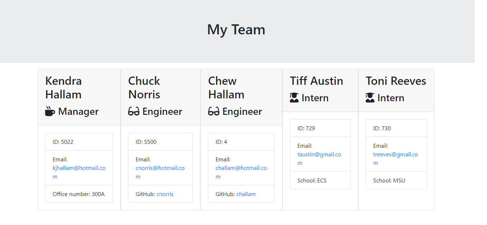

# 🔗 [Employee Summary](git@github.com:kjhallam/10_employee_summary.git)

## LICENSE


---

## 📓 DESCRIPTION

```
As a manager
I want to generate a webpage that displays my team's basic info
so that I have quick access to emails and GitHub profiles
```

---

## 📋 Table of Contents

  1. [DESCRIPTION](#description)
  2. [INSTALLATION](#installation)
  3. [USAGE](#usage)
  4. [CONTRIBUTING](#contributing)
  5. [TEST](#test)
  6. [GITHUB](#github)
  7. [QUESTIONS](#questions)
  
---

## 🖥️ INSTALLATION

npm i & app will run as a Node CLI to gather information about each employee

---

## 📓 USAGE

---

## 📓 CONTRIBUTING

n/a

---

## 🧪 TEST

Tested each team member (Manager, Engineer, Intern as a class)

---

## :octocat: GITHUB

[https://github.com/kjhallam](http://github.com/https://github.com/kjhallam)

---

## 🎥 PREVIEW


---

## 📷 SCREENSHOT



---

## ❓ QUESTIONS

If any questions concerning the use of the markdown file contact me at ✉️ [Email](kjhallam321@gmail.com).
